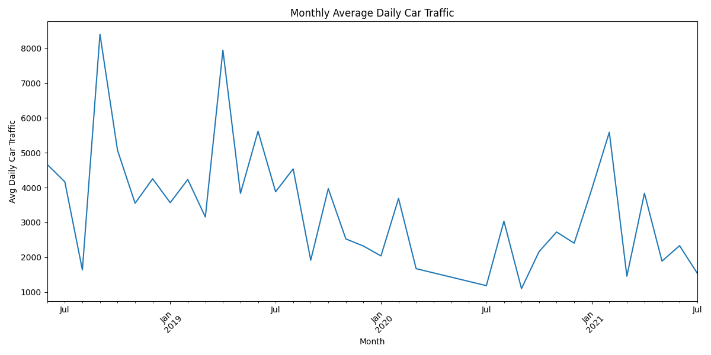

# Pittsburgh Traffic Count ETL and Analysis

**Author:** Synthia Pial

This project is a complete ETL (Extract, Transform, Load) and data analysis pipeline for City of Pittsburgh traffic count data. The workflow includes:

- Extracting raw traffic count CSV data
- Cleaning and transforming it into usable formats
- Loading the cleaned data into a SQLite database
- Performing exploratory data analysis
- Visualizing key traffic patterns
- Running simple prediction models

## Data Source

City of Pittsburgh Traffic Counts Dataset  
[Data.gov link](https://catalog.data.gov/dataset/city-of-pittsburgh-traffic-count)

## Project Overview

This project demonstrates real-world data engineering and analysis skills by working with raw traffic count data, transforming it for analysis, storing it in a database, and extracting meaningful insights and forecasts.

## Tools Used:
- Python (pandas, matplotlib, scikit-learn)
- SQLite
- SQL / DB Browser for SQLite

## ETL Pipeline

**Extract:**
- Reads a cleaned CSV with columns:
  - `count_start_date`
  - `average_daily_car_traffic`
  - `neighborhood`

**Transform:**
- Drops rows with missing or invalid data
- Parses dates consistently
- Converts traffic counts to numeric
- Aggregates traffic counts by neighborhood and month

**Load:**
- Saves cleaned data into a SQLite database (`traffic_analysis.db`)

**Database schema:**

TrafficData
- count_start_date (TIMESTAMP)
- average_daily_car_traffic (INTEGER)
- neighborhood (TEXT)


## Example Results

- Records after cleaning: 283
- Top neighborhoods by average traffic:
  - Regent Square (~16,729)
  - Crafton Heights (~11,500)
  - North Shore (~10,350)
- Sample busiest dates:
  - 2019-10-14 | 16,729 | Regent Square
  - 2019-06-28 | 15,000 | Bloomfield

## Visualizations

### 1. Top 10 Neighborhoods by Average Daily Car Traffic


### 2. Monthly Average Daily Car Traffic


### 3. Traffic Volume Prediction (Linear Regression)


## Predictive Modeling

- Used Linear Regression to model average daily car traffic over time
- Created a trend line forecasting future traffic volumes based on historical data
- Visualized predicted trend for the next 30 days
  

## How to Run

1. Clone the repository.
2. Install dependencies:
    ```bash
    pip install pandas matplotlib scikit-learn
    ```
3. Make sure the CSV file is named:
    ```
    pittsburgh_traffic_counts_cleaned.csv
    ```
4. Run the ETL and analysis pipeline:
    ```bash
    python pittsburgh_traffic_analysis.py
    ```
5. Explore:
    - SQLite database: `traffic_analysis.db`
    - Plots: `top_neighborhoods.png`, `monthly_trend.png`, `prediction_trend.png`

## Future Improvements

- Integrate real-time traffic APIs

- Interactive dashboard (Streamlit)

## License
This project is open for personal and educational use.


   
